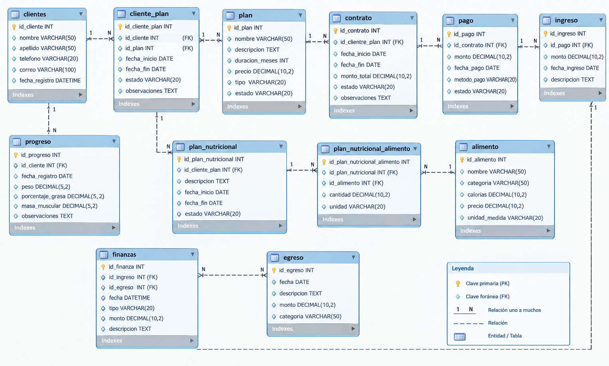

# Gym Manager CLI

Sistema CLI para la gestión de un gimnasio desarrollado con **Node.js** y **MySQL**. El proyecto aplica Programación Orientada a Objetos, principios SOLID, patrones de diseño, validaciones y transacciones reales en MySQL.

## Scrum

El proyecto se planificó utilizando **Scrum**. Al tratarse de un proyecto individual, yo Pablo López asumo las responsabilidades de **Product Owner, Scrum Master y Developer**.

### Product Goal

Desarrollar una aplicación CLI para administrar las operaciones principales de un gimnasio, permitiendo gestionar clientes, planes de entrenamiento, contratos, progreso físico, nutrición y movimientos financieros mediante Node.js y MySQL, manteniendo la integridad y consistencia de la información.

### Sprints

**Sprint 1 — Análisis y diseño de BD**

* Análisis de requisitos.
* Identificación de entidades.
* Normalización 1FN, 2FN y 3FN.
* Definición de PK, FK y relaciones.
* Diseño inicial del DER.

**Sprint 2 — Diseño funcional**

* Diseño de navegación CLI.
* Elaboración de diagramas de flujo.
* Diseño de procesos de clientes, planes, contratos, progreso, nutrición y finanzas.
* Identificación de operaciones críticas.

**Sprint 3 — Implementación Node.js + MySQL**

* Configuración de Node.js y MySQL.
* Modelos, repositorios y servicios.
* Comandos CLI.
* Repository Pattern y Factory Pattern.
* Transacciones y rollback.

**Sprint 4 — Integración, pruebas y documentación**

* Integración de módulos.
* Pruebas.
* Corrección de errores.
* Verificación de transacciones.
* Documentación y demostración.


## Diagrama Entidad-Relación

El DER representa la estructura de la base de datos después de aplicar la normalización.

Las 11 entidades son:

1. **CLIENTE**
2. **PLAN**
3. **CLIENTE_PLAN**
4. **CONTRATO**
5. **PROGRESO**
6. **PLAN_NUTRICIONAL**
7. **ALIMENTO**
8. **PLAN_NUTRICIONAL_ALIMENTO**
9. **PAGO**
10. **INGRESO**
11. **EGRESO**



El DER permite separar responsabilidades, reducir duplicidad y mantener relaciones mediante claves primarias y foráneas.

## Normalización

**1FN:** valores atómicos y eliminación de grupos repetitivos.

**2FN:** eliminación de dependencias parciales.

**3FN:** eliminación de dependencias transitivas y separación de responsabilidades.

## Patrones de diseño

### Repository Pattern

```text
Service → Repository → MySQL
```

Separa la lógica de negocio del acceso a datos.

### Factory Pattern

```text
AppFactory
 ├── Repositories
 └── Services
```

Centraliza la creación y conexión de las dependencias.

##  Transacciones MySQL

### Asignación de plan

```text
START TRANSACTION
 ├── INSERT cliente_plan
 ├── INSERT contrato
 └── COMMIT
```

Si ocurre un error se ejecuta `ROLLBACK`.

### Registro de pago

```text
START TRANSACTION
 ├── INSERT pago
 ├── INSERT ingreso
 └── COMMIT
```

Esto evita dejar información financiera incompleta.

## utor

**Pablo López**

## Scrum

La planificación completa del proyecto se encuentra en Notion:

[Ver SCRUM — GYM MANAGER CLI](https://app.notion.com/p/SCRUM-GYM-MANAGER-CLI-3e6a6286f67d80d28a8fdc8c53817cf2?source=copy_link)
